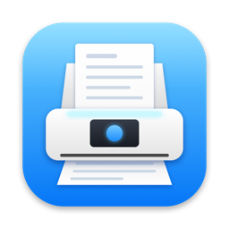
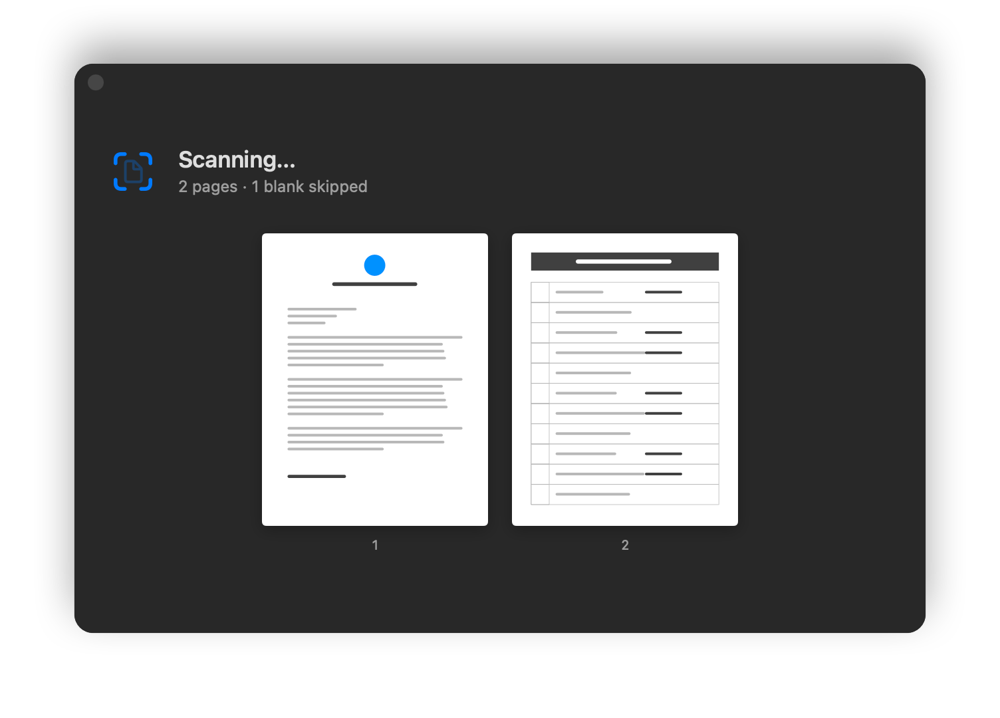
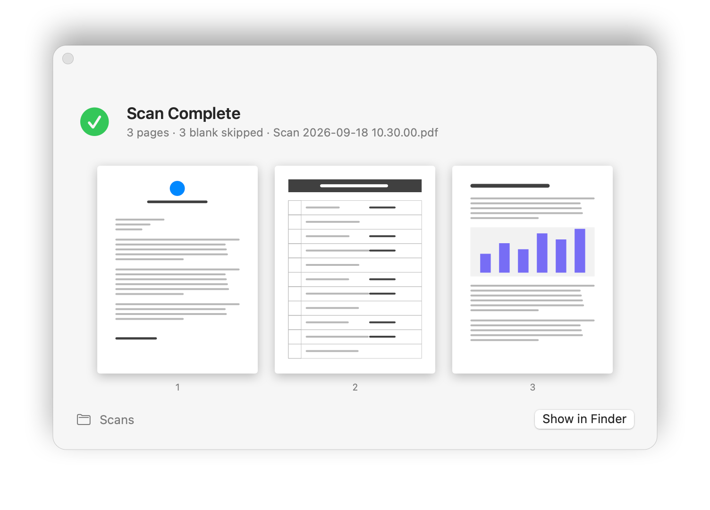
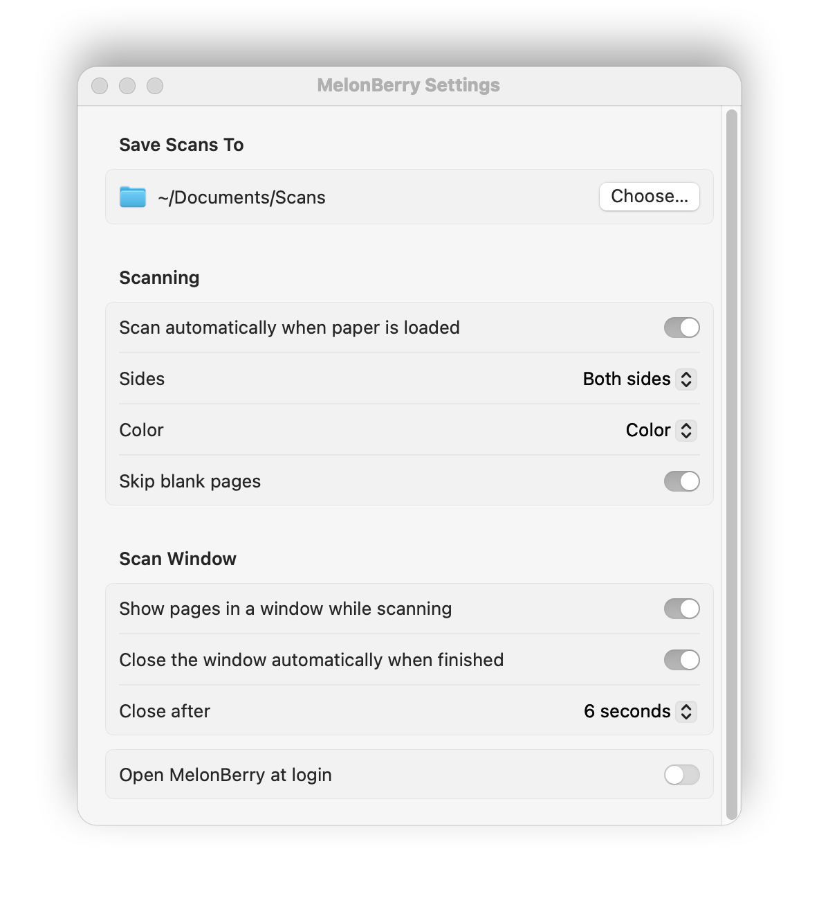

<p align="center"></p>

# MelonBerry

A tiny macOS menu bar app for sheet-fed document scanners. Drop paper in the feeder and a
searchable PDF appears in your folder — no buttons, no library, no profiles.

Built for (and tested with) a Fujitsu / Ricoh ScanSnap iX1600 over USB, using the open-source
[SANE](http://www.sane-project.org) driver instead of the vendor software. It should work with other
scanners supported by SANE's `fujitsu` backend that report a paper-loaded sensor.

<p align="center">
  
  
</p>

## What it does

- **Scans when you load paper.** It watches the feeder's paper sensor; three seconds after you drop a
  stack in, it scans everything, both sides.
- **Shows pages as they come through** in a floating window that never steals keyboard focus and closes
  itself when the PDF is saved (both optional).
- **Cleans up the result:** skips blank sides, turns upside-down pages the right way up, straightens
  skewed pages, and snaps near-Letter/A4/Legal pages to an exact size so the PDF is uniform.
- **OCRs everything** so the PDF is searchable. If OCR fails you still get the image-only PDF.
- Saves to a folder you choose as `Scan 2026-09-18 10.30.00.pdf`, at roughly 1 MB per color page.

<p align="center"></p>

## Install

Requires macOS 14 or later, Xcode command line tools, and [Homebrew](https://brew.sh).

```sh
brew install sane-backends ocrmypdf img2pdf
git clone https://github.com/joshkerr/melonberry.git
cd melonberry
./build.sh --install     # builds MelonBerry.app, copies it to /Applications, launches it
```

Connect the scanner by USB and check that SANE can see it with `scanimage -L`.

**Quit the vendor's scanning software first**, including its background helpers — only one program can
hold the scanner's USB connection. If MelonBerry's menu says *Scanner busy*, that's why. Remove the
helpers from System Settings → General → Login Items if you want MelonBerry to own the scanner for good.

## How it works

```
paper sensor ──▶ scanimage (SANE) ──▶ blank check + page sizing ──▶ img2pdf ──▶ OCRmyPDF ──▶ your folder
```

- `scanimage -A` exposes the scanner's hardware sensors; polling `--page-loaded` once a second takes ~35 ms.
- Pages are scanned at 300 dpi to PNG. Each one is measured for ink coverage (blank sides score ~0.00%
  dark pixels, a page with a single short line ~0.05%; the cutoff is 0.03%), centered on a standard
  page size when it is close to one, and written as a JPEG.
- [OCRmyPDF](https://ocrmypdf.readthedocs.io) adds the text layer, deskews, and rotates pages. The rotation
  confidence threshold is lowered from 14 to 3 — dense forms often score below the default even when
  the detected orientation is right.
- The driver's own `--swdeskew` is deliberately off: it keys on text lines, so it spins blank and
  sparse pages to wild angles.

## Limitations

- **USB only.** SANE cannot talk to the iX1600 over Wi-Fi.
- **The scanner's touchscreen Scan button stays grayed out.** The screen is driven by the vendor's
  proprietary protocol, which SANE doesn't implement. That's why the paper sensor is the trigger.
- The app shells out to Homebrew tools, so it is not sandboxed and not distributable through the App Store.

## Command-line version

`scan` does one batch from the terminal with the same pipeline, and `scan-watch` is the paper-triggered
loop as a shell script. Don't run `scan-watch` while the app is running; they would fight over the scanner.

## Development

```sh
./build.sh                       # build/MelonBerry.app
./build.sh --install             # …and install + relaunch
open -W -n build/MelonBerry.app --args --screenshots "$PWD/docs"   # re-render the README screenshots

# watch what the app is doing
log stream --info --predicate 'subsystem == "com.joshkerr.MelonBerry"'
```

The app icon is drawn in code (`Support/make-icon.swift`), as is the menu bar glyph
(`Sources/MelonBerry/MenuBarIcon.swift`). The screenshots above are rendered from the app's real views
with generated sample pages.

## License

[MIT](LICENSE)

---

MelonBerry is an independent project. It is not affiliated with, endorsed by, or supported by Fujitsu,
PFU, or Ricoh. ScanSnap is a trademark of its respective owner and is mentioned here only to describe
hardware compatibility.
